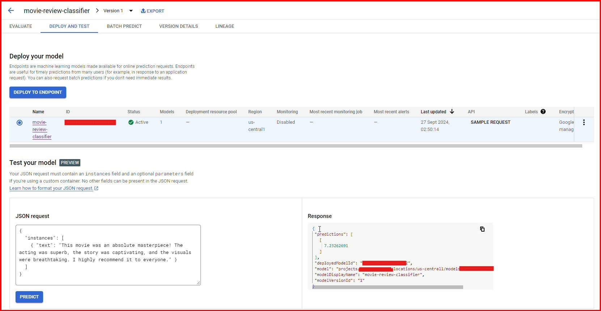
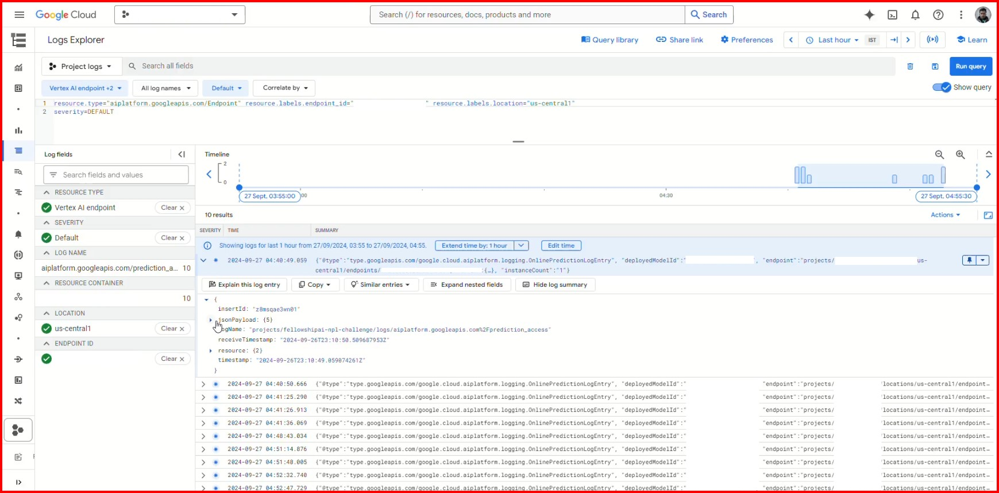

# **Sentiment Analysis using IMDB Dataset of 50K Movie Reviews**

[www.arjunraghunandanan.com](https://www.arjunraghunandanan.com/) | September 2024

This github repo is used to consolidate project notebooks file, additional files and documents related to the project for submission. 

## Project Overview

* This project focuses on sentiment analysis of movie reviews using the IMDB dataset.
* Generated a ML model that classifies movie reviews to Positive / Negative.
* Multiple approaches were tested.
* Project includes a deploying to GCP and testing with End User Web App.
* This project is part of a Fellowship.AI Code Challenge Submission by me.

## Prediction Summary

### Fellowship.AI NLP Challenge: IMDB50K : TF-text 
* Uses tensorflow-text & Bert for sentiment analysis.
    * Epoch 1: binary_accuracy: 0.7663, val_binary_accuracy: 0.8507
    * Epoch 2: binary_accuracy: 0.8665, val_binary_accuracy: 0.8555
    * Epoch 3: binary_accuracy: 0.9062, val_binary_accuracy: 0.8705
    * Epoch 4: binary_accuracy: 0.9336, val_binary_accuracy: 0.8684
    * Epoch 5: binary_accuracy: 0.9487, val_binary_accuracy: 0.8717
    * Eval :  **Loss = 0.4476686418056488, Accuracy = 0.8694000244140625**

### NLP Challenge using Bert 
* Uses a BERT model for sentiment analysis.
    * Epoch 1: binary_accuracy: 0.7649, val_binary_accuracy: 0.8522
    * Epoch 2: binary_accuracy: 0.8660, val_binary_accuracy: 0.8581
    * Epoch 3: binary_accuracy: 0.9062, val_binary_accuracy: 0.8600
    * Epoch 4: binary_accuracy: 0.9315, val_binary_accuracy: 0.8700
    * Epoch 5: binary_accuracy: 0.9501, val_binary_accuracy: 0.8705
    * Eval : **Loss: 0.4606824815273285, Accuracy: 0.8679999709129333**

### Multiple Model Approach NLP : IMDB50K 

*   **simple_logistic_model** 
    *   Test Accuracy: 80.18%

*   **grid_search_logistic_model** 
    *   Best hyperparameters found: {'C': 10, 'solver': 'liblinear'}
    *   Test Accuracy: 80.05%

*   **simple_randomforest_model** 
    *   Test Accuracy: 76.02%

*   **lstm_model** 
    *   Test Accuracy: 84.54%

**Results as of 27 Sept 2024**

## Notebook Links

Some notebooks were tested in Google Colab and are not included here or in submission. 

## Simple Web App Interface
###  UI Planned Before Development (Mock-Up)

| Negative Sentiment | Positive Sentiment |
|---|---|
|  |  |

### UI After Development (Working)

 

### Model Deployment 
I skipped Multiple Model Method and only using model from 'Fellowship.AI NLP Challenge: IMDB50K : TF-text' to reduce GCP Deployment cost. 

| Vertex AI Endpoint Deployment | Endpoint Call Logs |
|---|---|
|   |   |

Not hosting a Live Preview to avoid Usage Cost(I undeployed after testing) [Vertex AI Pricing](https://cloud.google.com/vertex-ai/pricing#custom-trained_models).

## About the Data

* **Dataset:** IMDB Dataset of 50K Movie Reviews
* **Description:** This dataset is designed for binary sentiment classification (positive or negative) of movie reviews. It contains a significantly larger amount of data than previous benchmark datasets. The dataset is split into 25,000 reviews for training and 25,000 for testing. Additionally, there is unlabeled data that can be utilized. The dataset is available in both raw text format and a processed bag-of-words format.
* **Source:**
    * Lakshmipathi N [lakshmi25npathi]. IMDB Dataset of 50K Movie Reviews. kaggle.com
    * [https://www.kaggle.com/datasets/lakshmi25npathi/imdb-dataset-of-50k-movie-reviews](https://www.kaggle.com/datasets/lakshmi25npathi/imdb-dataset-of-50k-movie-reviews)
    * Original Dataset: [http://ai.stanford.edu/~amaas/data/sentiment/](http://ai.stanford.edu/~amaas/data/sentiment/)

## Future Improvements

*   The high loss value indicates overfitting, so I need to use some adding more regularization, drop out layers or early stopping methods or try something else entirely. 
*   Since my project plan included training the model, developing a client UI, hosting, and serving demo. So, some fine-tuning was compromised.
*   This was a simple experimentation. More fine-tuning should be experimented with to increase accuracy. 
*   Should consider testing further methods like Naive Bayes and SVM.
*   I also found it difficult to easily adjust code / libraries / training method to utilize CPU/GPU/TPU offerings of colab and kaggle correctly. So, i need to work on understanding the methods more.
*   Try implementing Multiple Model Choosing and Multi Model Prediction as planned prior to project (with local hosting to reduce deployment cost)
*   Going through metrics, I noticed that the GridSearch did not find the best model while simple logistic regression did. Should go through parameters and code functions to see what went wrong.
*   I used Vertex AI Endpoint Deployment method to test the model prediction using endpoint calling which worked. (refer webapp/app.py for code)
*   Since I used tensorflow-text 2.13.1 instead of tensorflow, it needs its environments
*   While I did experiment with hosting a live preview on Streamlit Cloud, the 100+ Mb model files were causing issues with getting the model onto Github and st.cache() issues. Will sort this out on a later project. 

Here is a Tabulated Datasheet incase anyone want to see. 

### Multiple Model Approach  Movie Review Classification Results

 Negative Reviews (Movie Reviews classified as 0)

| Model                   | Test Accuracy | Precision (Negative Review) | Recall (Negative Review) | F1-Score (Negative Review) | Support (Negative Review) |
|-------------------------|---------------|-----------------------------|--------------------------|----------------------------|---------------------------|
| Logistic Regression      | 80.18%        | 0.80                        | 0.81                     | 0.80                       | 3704                      |
| Best Logistic Regression | 80.12%        | 0.80                        | 0.81                     | 0.80                       | 3704                      |
| Random Forest            | 76.31%        | 0.77                        | 0.74                     | 0.76                       | 3704                      |
| LSTM                     | 84.55%        | 0.86                        | 0.83                     | 0.84                       | 3704                      |

---

 Positive Reviews (Movie Reviews classified as 1)

| Model                   | Test Accuracy | Precision (Positive Review) | Recall (Positive Review) | F1-Score (Positive Review) | Support (Positive Review) |
|-------------------------|---------------|-----------------------------|--------------------------|----------------------------|---------------------------|
| Logistic Regression      | 80.18%        | 0.81                        | 0.80                     | 0.80                       | 3734                      |
| Best Logistic Regression | 80.12%        | 0.81                        | 0.80                     | 0.80                       | 3734                      |
| Random Forest            | 76.31%        | 0.75                        | 0.78                     | 0.77                       | 3734                      |
| LSTM                     | 84.55%        | 0.83                        | 0.87                     | 0.85                       | 3734                      |

---

 Macro, Weighted Averages, and Total Support (Movie Reviews)

| Model                   | Macro Avg Precision | Macro Avg Recall | Macro Avg F1-Score | Weighted Avg Precision | Weighted Avg Recall | Weighted Avg F1-Score | Total Support (Movie Reviews) |
|-------------------------|---------------------|-------------------|--------------------|------------------------|--------------------|-----------------------|-------------------------------|
| Logistic Regression      | 0.80                | 0.80              | 0.80               | 0.80                   | 0.80               | 0.80                  | 7438                          |
| Best Logistic Regression | 0.80                | 0.80              | 0.80               | 0.80                   | 0.80               | 0.80                  | 7438                          |
| Random Forest            | 0.76                | 0.76              | 0.76               | 0.76                   | 0.76               | 0.76                  | 7438                          |
| LSTM                     | 0.85                | 0.85              | 0.85               | 0.85                   | 0.85               | 0.85                  | 7438                          |

What does that mean?
TL;DR: 
* Look for :
   * Test Accuracy
   * Precision (Positive)
   * Recall (Positive)
   * Precision (Negative)
   * Recall (Negative)
   * f1-scores
  
Higher numbers are better

Final Takes : I did this project as a submission for fellowship AI. But, after developing the project, I decided to not proceed with my application because the ML Fellow position is a 4 month long Unpaid Fellowship Program will a Full-Time Commitment requirement. I definitely cannot afford to do an unpaid internship at the moment. I need a paid job.

Job titles

Location types

Locations (on-site)

Locations (remote)

Start date

Employment types

<< ----- Proceeding to explore what cool projects I can do till then.  The End ----- >>

