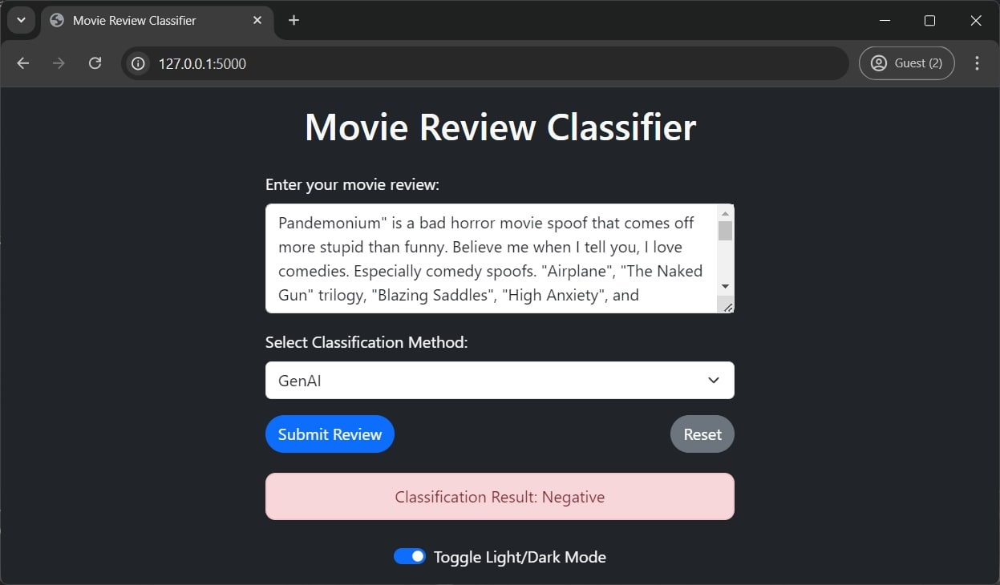

# **Sentiment Analysis using IMDB Dataset of 50K Movie Reviews**

A Fellowship.AI Code Challenge Submission by @arjunraghunandanan

[www.arjunraghunandanan.com](https://www.arjunraghunandanan.com/) | September 2024

This github repo is used to consolidate project notebooks file, additional files and documents related to the project for submission. 

## Project Overview

* This project focuses on sentiment analysis of movie reviews using the IMDB dataset. 
* Multiple approaches were tested.
* Project includes a deploying to GCP and testing with End User Web App. (clear documentation pending.)

## Prediction Summary

### Fellowship.AI NLP Challenge: IMDB50K : TF-text (Submission)

*   Accuracy: 0.8694

### NLP Challenge using Bert (Tests only)

*   Accuracy: 0.8688

### Multiple Model Approach NLP : IMDB50K (Tests only)

*   **simple_logistic_model** 
    *   Test Accuracy: 80.18%

*   **grid_search_logistic_model** 
    *   Best hyperparameters found: {'C': 10, 'solver': 'liblinear'}
    *   Test Accuracy: 80.05%

*   **simple_randomforest_model** 
    *   Test Accuracy: 76.02%

*   **lstm_model** 
    *   Test Accuracy: 84.54%

**Results as of 27 Sept 2024**

## Notebook Links

Some notebooks were tested in colab and are not included here or in submission. 

## Simple Web App Interface
###  UI Planned Before Development (Mock-Up)

| Negative Sentiment | Positive Sentiment |
|---|---|
|  |  |

### UI After Development (Working)

 

I skipped Multiple Model Method and only using model from 'Fellowship.AI NLP Challenge: IMDB50K : TF-text' to reduce GCP Deployment cost.

## About the Data

* **Dataset:** IMDB Dataset of 50K Movie Reviews
* **Description:** This dataset is designed for binary sentiment classification (positive or negative) of movie reviews. It contains a significantly larger amount of data than previous benchmark datasets. The dataset is split into 25,000 reviews for training and 25,000 for testing. Additionally, there is unlabeled data that can be utilized. The dataset is available in both raw text format and a processed bag-of-words format.
* **Source:**
    * Lakshmipathi N [lakshmi25npathi]. IMDB Dataset of 50K Movie Reviews. kaggle.com
    * [https://www.kaggle.com/datasets/lakshmi25npathi/imdb-dataset-of-50k-movie-reviews](https://www.kaggle.com/datasets/lakshmi25npathi/imdb-dataset-of-50k-movie-reviews)
    * Original Dataset: [http://ai.stanford.edu/~amaas/data/sentiment/](http://ai.stanford.edu/~amaas/data/sentiment/)

## Future Improvements

*   My project included training the model, developing a client UI, hosting, and serving it. So, some fine-tuning was compromised.
*   This was a simple experimentation. More fine-tuning should be experimented with to increase accuracy. 
*   Should consider testing further methods like Naive Bayes and SVM.
*   I also found it difficult to easily adjust code / libraries / training method to utilize CPU/GPU/TPU offerings of colab and kaggle correctly. So, i need to work on understanding the methods more.
*   Try implementing Multiple Model Choosing and Multi Model Prediction as planned prior to project (with local hosting to reduce deployment cost)

